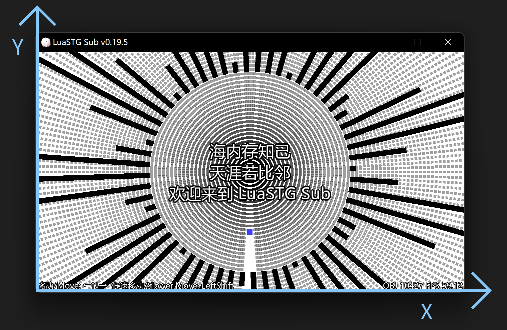
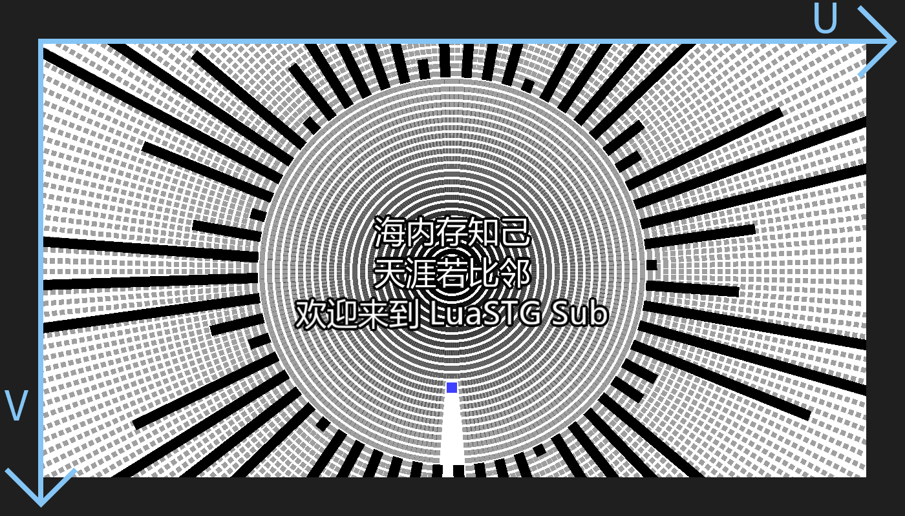

# Coordinate System

## Window Coordinate System

The origin of the window coordinate system of LuaSTG is located in the lower left corner of the client area of the window, the X axis is positive to the right, and the Y axis is positive upward.

Related API
* lstg.SetResolution
* lstg.EnumResolutions
* lstg.ChangeVideoMode
* lstg.GetMousePosition
* lstg.PostEffect

## Texture's Normalized UV Coordinate System

The origin of the normalized UV coordinate system of the texture is located in the upper left corner of the texture, the U-axis is positive to the right, and the V-axis is down. This is also the texture coordinate system used by various graphics APIs (OpenGL, Direct3D, Metal, Vulkan, etc.).

Related Content
* Post-processing effect shader (HLSL)

## Renderer's RenderTarget Coordinate System

The coordinate system used by the LuaSTG renderer when setting certain rendering states for the RenderTarget. The origin is at the lower left corner of the render target, the X-axis is positive to the right, and the Y-axis is positive up.

If no size is specified when creating a RenderTarget, the size of the RenderTarget is automatically synchronized to the size of the window, so at this time, it can be considered that the "Renderer's RenderTarget Coordinate System" and the "Window Coordinate System" are equal.

Related API
* lstg.CreateRenderTarget
* lstg.SetViewport
* lstg.SetScissorRect

## Renderer's Texture UV Coordinate System (Unit: Pixel)

LuaSTG's renderer sets the unit of the texture UV coordinate system of some APIs to pixels for convenience, rather than the normalized coordinate system of 0.0 to 1.0. The origin is located in the upper left corner of the texture, the U-axis is positive to the right, and the V-axis is down.

Related API
* lstg.RenderTexture
* lstg.GetTextureSize
* lstg.LoadImage
* lstg.LoadAnimation
* lstg.CurveLaser:Render

## Renderer's Custom 2D/3D Coordinate System

This part is quite free and completely customizable by the developer.

Setting The Coordinate System API
* lstg.SetOrtho
* lstg.SetPerspective

Using The Coordinate System API
* lstg.RenderRect
* lstg.Render
* lstg.RenderAnimation
* lstg.Render4V
* lstg.RenderTexture
* lstg.RenderText
* lstg.RenderTTF
* lstg.RenderModel
* lstg.DrawCollider
* lstg.RenderGroupCollider
* lstg.DefaultRenderFunc
* lstg.CurveLaser:Update
* lstg.CurveLaser:UpdateNode
* lstg.CurveLaser:UpdateAllNode
* lstg.CurveLaser:SetAllWidth
* lstg.CurveLaser:Render
* lstg.CurveLaser:RenderCollider
